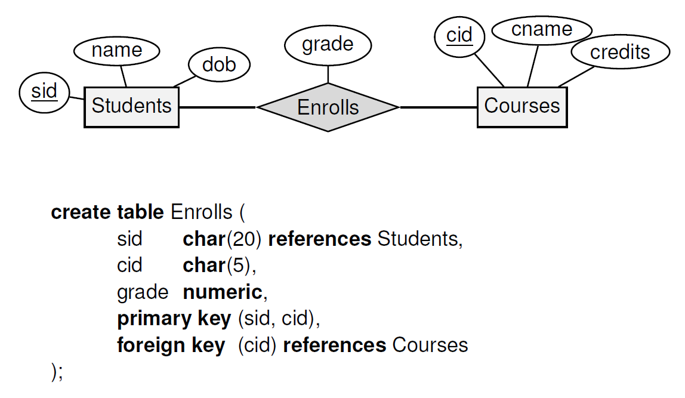

### Overview of Entities

* Course
    * string name
    * float price
* OrderItem
    * Course course
    * string special_requirements
    * enum status
        * pending
        * preparing
        * ready
        * delivered
* Table
    * int table_number
    * string location
* Order
    * OrderItem[] items
    * int calling_number
        * this number is self-incremental, resets every day
    * Table table
    * enum status
        * preapring
        * ready
        * delivered

### Basic Field Types (Records)

* Numbers
    * IntegerField
    * FloatField
* Text
    * CharField: for text with known/max length
    * TextField: for paragraphs of text
* Others
    * BooleanField
    * DateField
    * FileField

Let's take `Course` model as an example:

1. Create a new Python package `models` under `app/models` folder; create `course.py` with the following:

```python
from django.db import models


class Course(models.Model):
    name = models.CharField(max_length=128)
    price = models.FloatField()

    def __str__(self):
        return f'Course - {self.name} - ${self.price}'
```

In `app/models/__init__.py`, add the following:

```python
from app.models.course import *
```

2. Register the model in Django admin: in `app/admin.py`

```python
from django.contrib import admin

from app.models import Course

# Register your models here.
admin.site.register(Course)
```

3. Make migrations: `python manage.py makemigrations`
4. Migrate: `python manage.py migrate`

Then you should be able to access `localhost:8000/admin` to manage the Course model... but wait! What's our username and
password? Glad you asked - you may use `python manage.py createsuperuser` to create the user.

### Common Field Options

ref: https://docs.djangoproject.com/en/4.0/ref/models/fields/#field-options

* null
* blank
* choices
* default
* unique
* unique_for_date
    * ~month
    * ~year

### ForeignKey (Many-To-One Relationship)

ref: https://docs.djangoproject.com/en/4.0/ref/models/fields/#django.db.models.ForeignKey

The relationship between OrderItem and Order is a classic many-to-one relationship: an order item belongs to one and
only one order, and an order may include many order items. To model this relationship, we use `ForeignKey` field in
Django model. There are two required arguments for a `ForeignKey` field: `to` and `on_delete`:

* `to`: the model we refer to, it can be the model class (`app.models.Order`) or the model name (`Order`). If you want
  to create a self-referential foreign key, use `'self'`.
* `on_delete`: what happens if the target object is deleted. For example, what should we do to the order items if the
  order is deleted? There are many possible options defined in `django.db.models`, here are some common ones:
    * CASCADE: the order items will be deleted
    * PROTECT: if there exists an order that at least one order item refers to, you cannot delete this order unless all
      related order items are deleted.
    * SET_NULL: order item will refer to a NULL order
    * SET_DEFAULT: similar to SET_NULL, but set to the default value

### ManyToManyField

ref: https://docs.djangoproject.com/en/4.0/ref/models/fields/#manytomanyfield

- to: the model we refer to
    - same as ForeignKey
- NOTE: unlike ForeignKey, no on_delete option is provided
    - because the underlying implementation is by creating a relational entity!
- Example: Students <-> Courses, Group <-> User (later)
    - 

### CRUD with Django Shell

ref: https://docs.djangoproject.com/en/4.0/intro/tutorial02/#playing-with-the-api

```python
>>> from app.models import Course, Order, OrderItem, Table
# List objects
>>> Course.objects.all()
<QuerySet [<Course: Course - Chicken Rice - $3.5>]>

# Create
>>> c = Course(name='Big Mac', price=5.5)
>>> c.save()
>>> Course.objects.all()                  
<QuerySet [<Course: Course - Chicken Rice - $3.5>, <Course: Course - Big Mac - $5.5>]>

# Read properties
>>> c.name
'Big Mac'

# Update object
>>> c.name = 'Big Big Mac'
>>> c.save()
>>> Course.objects.all()                                     
<QuerySet [<Course: Course - Chicken Rice - $3.5>, <Course: Course - Big Big Mac - $5.5>]>

# Delete object
>>> bbm = Course.objects.all()[1]    
>>> bbm.delete()
(1, {'app.Course': 1})
>>> Course.objects.all()          
<QuerySet [<Course: Course - Chicken Rice - $3.5>]>

# Filter
>>> Order.objects.filter(status=Order.STATUS_DELIVERED)
<QuerySet [<Order: Order[1] - Table 1 - D>, <Order: Order[2] - Table 1 - D>]>
>>> Order.objects.filter(table__location='Left')
<QuerySet [<Order: Order[1] - Table 1 - D>, <Order: Order[2] - Table 1 - D>]>
```